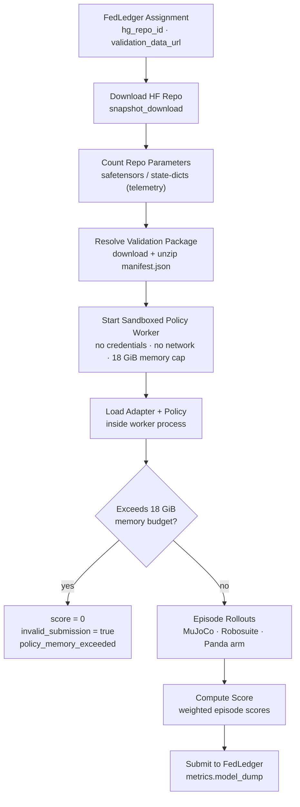

# Robotics VLA Validator

Validates Vision-Language-Action (VLA) policies submitted to [FLock AI Arena](https://flock.io) for the robotics task type. Miners submit a HuggingFace model repository containing a policy and a thin adapter file; the validator downloads it, rolls out the policy in a MuJoCo tabletop simulation, and scores task completion.

---

## Evaluation Pipeline



Each step that touches miner code retries up to 3 times on transient failure before the submission is declared invalid.

### Adapter isolation

Miner Python never executes in the validator process. A persistent worker imports
the adapter, loads the model, and serves `policy.act` calls over a bounded JSON
protocol (pickle is never accepted from the worker). The worker:

- receives an environment allowlist with no `FLOCK_API_KEY`, `HF_TOKEN`, cloud
  credentials, proxy settings, or validator home directory;
- has CPU, open-file, output-file, and per-call wall-time limits, plus the memory
  ceiling described below;
- initializes the trusted PyTorch/CUDA runtime before enabling filesystem and
  syscall isolation, then imports all miner adapter code inside the sandbox;
- cannot create child processes, execute other programs, or use network syscalls
  under the production Linux seccomp policy; and
- is killed as a process group on timeout, protocol failure, or a memory breach.

Consequently, all model code and weights needed at inference time must be present
in the downloaded repository. An adapter cannot fetch a base model at runtime.

### Model-size limit (runtime memory, not parameter count)

Model size is bounded by a hard **memory ceiling on the policy worker** —
`policy_memory_limit_gb` (default **18 GiB**) — not by a static parameter count.
A static count can be defeated by reconstructing weights at inference time (from a
`bytes`/`str` blob, a file, a dependency module, or a dynamic lookup), so it is
reported only as telemetry. The memory ceiling is representation-agnostic:
however the weights are encoded, they occupy memory, and the worker is held to the
budget two ways:

- **GPU VRAM** — the worker caps its CUDA allocator
  (`torch.cuda.set_per_process_memory_fraction`) so an oversize model hard-OOMs at
  load. Raw, non-`torch` CUDA allocations are not covered by this cap.
- **System RAM** — a host-side monitor polls the worker's resident memory and
  kills it (→ `policy_memory_exceeded`) if it stays over budget. This closes the
  "hide weights in host RAM and stream them to the GPU" path. On CPU deployments a
  kernel `RLIMIT_AS` backstop is applied as well; on CUDA it is not, because a
  model-sized address-space limit would break CUDA initialisation.

A submission that fits in the budget may hold however many parameters it likes
(e.g. a larger quantized model), so the effective cap scales with dtype: 18 GiB is
roughly a 4.5B-parameter model in fp32, or a larger one in bf16/int8.

> **Operator note:** for a hard, kernel-enforced ceiling that also covers raw CUDA
> allocations, run the validator (and thus the worker) inside a container with a
> cgroup memory limit. The in-process controls above are the portable default.

---

## Scoring

The primary optimisation target is **`loss`** (lower is better). Score is the complementary metric (higher is better).

### Per-episode score

```
progress_score  = 1.0                          if task succeeded
                  clip(best_shaped_reward, 0, 1) otherwise

episode_score   = 1.0                          if task succeeded
                  0.40 × progress_score         otherwise   ← partial credit, capped at 40%
```

### Difficulty weighting

Each episode in the manifest carries a `difficulty` tag that scales its contribution:

| Difficulty  | Weight |
|-------------|--------|
| `low`       | 0.75   |
| `medium`    | 1.00   |
| `hard`      | 1.25   |
| `very_high` | 1.50   |

### Final metrics

```
weighted_episode_score = weighted_mean(episode_score,  weights=difficulty_weights)
loss                   = weighted_mean(1−episode_score, weights=difficulty_weights)
score                  = weighted_episode_score
```

A fully failing submission (`episode_score = 0` everywhere) scores **loss = 1.0**.  
A perfect submission (`episode_score = 1` everywhere) scores **loss = 0.0**.

---

## Submission Contract

Miners must push a HuggingFace repository containing:

| File | Required | Description |
|------|----------|-------------|
| `flock_robotics_adapter.py` | **Yes** | Defines `load_policy(model_dir, device, dtype) → policy` where `policy.act(obs) → np.ndarray shape (7,)` |
| Model weights | **Yes** | `*.safetensors` or `*.pt` / `*.bin` files. The policy (weights + inference working set) must fit within the sandbox memory ceiling (default **18 GiB**); see [Model-size limit](#model-size-limit-runtime-memory-not-parameter-count). Parameter count is reported as telemetry, not enforced. |

### Observation dict passed to `policy.act`

```python
obs = {
    "image":       np.ndarray,   # uint8 HxWx3, agentview camera (default 224×224)
    "instruction": str,          # natural-language task description
    "proprio":     np.ndarray,   # float32, concatenation of joint pos/vel, eef pos/quat, gripper
    "task":        str,          # e.g. "lift_cube", "pick_place_can"
    "step":        int,          # current timestep within the episode
    "difficulty":  str | None,   # episode difficulty tag
    "horizon":     int,          # total steps in this episode
}
```

### Action format

`policy.act(obs)` must return a `(7,)` float32 array in `[-1, 1]`.  
Values outside `[-1, 1]` are clipped. Actions are mapped to the Panda OSC controller:

| Index | Dimension |
|-------|-----------|
| 0–2   | End-effector Δx, Δy, Δz |
| 3–5   | End-effector Δroll, Δpitch, Δyaw |
| 6     | Gripper open (−1) / close (+1) |

---

## System Requirements

### Hardware

- **GPU**: CUDA-capable GPU strongly recommended (the validator loads full VLM weights).
  The reference model (Qwen2.5-VL-3B + 1.2 B action head ≈ 4.06 B params) fits in ~10 GB VRAM at bfloat16.
  The policy sandbox is held to a **18 GiB memory ceiling** (`policy_memory_limit_gb`);
  see [Model-size limit](#model-size-limit-runtime-memory-not-parameter-count).
- **RAM**: ≥ 32 GB system RAM for large model repos.
- **Disk**: ≥ 30 GB free for model cache + robosuite assets.

### OS / system libraries

| Requirement | Notes |
|-------------|-------|
| Linux (x86-64) | Recommended for MuJoCo EGL rendering. macOS works for CPU-only testing. |
| Python 3.10 or 3.11 | **3.12 is not supported** — robosuite depends on packages with C extensions that do not yet publish 3.12 wheels. |
| EGL libraries (headless Linux) | `apt-get install -y libegl1 libopengl0 libglx0` — required for MuJoCo offscreen rendering without a display. |
| NVIDIA driver | 525+ recommended when using a GPU. |

### Python packages

All Python dependencies are declared in [`environment.yml`](environment.yml) and are installed automatically by `run.py`. The key ones:

```
mujoco==3.9.0       robosuite==1.5.2     torch           torchvision
transformers        peft                 safetensors      accelerate
huggingface-hub     numpy                pillow           imageio
```

---

## Running Validation

### Prerequisites

```bash
# 1. Clone the repo and install the outer-layer requirements
pip install -r requirements.txt

# 2. (Linux headless only) install EGL libs if not already present
apt-get install -y libegl1 libopengl0 libglx0

# 3. Export credentials
export FLOCK_API_KEY="your_flock_api_key"
export HF_TOKEN="your_huggingface_token"       # needed for private/gated model repos
```

`run.py` creates (or updates) the `flock-validation-robotics_vla` conda environment — or a local venv if conda is absent — and installs all dependencies from `environment.yml` on first run. No manual `pip install` of robotics dependencies is needed.

### One-command production run (FedLedger loop)

```bash
python run.py robotics_vla \
  --task_ids "$ROBOTICS_TASK_ID" \
  --flock-api-key "$FLOCK_API_KEY" \
  --hf-token "$HF_TOKEN"
```

This starts a polling daemon that fetches assignments from FedLedger, validates each submission, and submits results. It keeps running until interrupted.

After each validation attempt, the validator removes the downloaded model revision
from the Hugging Face cache. Model directories supplied as local paths are never
deleted.

### Local validation (no FedLedger)

Validate a specific HuggingFace model repo or local directory without a live assignment:

```bash
python run.py robotics_vla \
  --local-validation \
  --hf-model-repo "org/model-repo" \
  --validation-data-url "/path/to/validation_package.zip" \
  --hf-token "$HF_TOKEN"
```

Optionally limit the number of episodes for a faster smoke-test:

```bash
python run.py robotics_vla \
  --local-validation \
  --hf-model-repo "org/model-repo" \
  --validation-data-url "/path/to/validation_package.zip" \
  --max-episodes 3 \
  --hf-token "$HF_TOKEN"
```

A successful run prints metrics including `invalid_submission: false` and the final `loss` / `score`.

---

## FAQ

### EGL / rendering errors on headless servers

**Symptom:**
```
AttributeError: 'NoneType' object has no attribute 'eglQueryString'
mujoco.FatalError: gladLoadGL error
```

**Fix:** Install the GLVND EGL dispatch library — the NVIDIA vendor driver alone is not enough:
```bash
apt-get install -y libegl1 libopengl0 libglx0
```

Then ensure the environment variables are set before launching:
```bash
export MUJOCO_GL=egl
export PYOPENGL_PLATFORM=egl
```

`run.py` sets these automatically inside the validation environment, but they are needed if you run the inner script directly.

---

### Python 3.12 not supported

**Symptom:**
```
ERROR: Could not find a version that satisfies the requirement robosuite==1.5.2
```
or a C-extension build failure during `pip install`.

**Fix:** Use Python 3.10 or 3.11. If using conda:
```bash
conda create -n robotics_vla python=3.11
```

---

### `torchvision` missing

**Symptom:**
```
ImportError: Qwen2VLVideoProcessor requires the Torchvision library. ...
```

**Fix:** `torchvision` is listed in `environment.yml` and installed automatically by `run.py`. If running the inner entrypoint directly in a bare environment:
```bash
pip install torchvision
```

---

### `ModuleNotFoundError: No module named 'validator'`

**Symptom:** Occurs when running training scripts or inner modules directly from the shell.

**Fix:** Run from the repo root with the `PYTHONPATH` set:
```bash
PYTHONPATH=/path/to/flock-validator python validator/modules/robotics_vla/...
```

---

### `adapter_contract: adapter_filename must resolve inside the model directory`

**Symptom:** Validation fails with `failure_mode: adapter_contract` even though the adapter file is present.

**Cause (for adapter authors):** The adapter filename passed in `RoboticsVLAInputData.adapter_filename` contains `..` components or is an absolute path. The contract requires the adapter to be at the top level of the model repo.

**Note:** HuggingFace `snapshot_download` stores repo files as symlinks into a sibling `blobs/` directory. The validator handles this correctly using a lexical path check — it does not follow symlinks, so a legitimate HF download will never trigger this error.

---

### CUDA out of memory

**Symptom:**
```
torch.OutOfMemoryError: CUDA out of memory.
```

**Options:**
- Use `torch_dtype: bfloat16` in `configs/robotics_vla.json` (default).
- Set `device: cpu` in the config for CPU-only testing (much slower).
- Reduce `max_episodes` to shorten the run without loading a second model.

The validator loads the full policy once and rolls out all episodes sequentially; OOM during loading means the GPU does not have enough VRAM for the model.

---

### Validation never picks up an assignment

**Symptom:** The daemon polls indefinitely with `No assignment found`.

**Check:**
1. Confirm `ROBOTICS_TASK_ID` is correct and the task is active on FedLedger.
2. Confirm `FLOCK_API_KEY` is valid (test with the FedLedger API directly).
3. Check `--assignment-lookup-interval` (default 180 s) — the daemon sleeps between polls.

---

### `invalid_submission: true` in the result

The submission was scored 0. The `diagnostics.failure_mode` field explains why:

| `failure_mode` | Meaning |
|----------------|---------|
| `adapter_missing` | No `flock_robotics_adapter.py` in the repo |
| `adapter_contract` | Adapter filename escapes the model directory |
| `adapter_import_failed` | The adapter file raised an exception on import |
| `model_load_failed` | `load_policy(...)` raised an exception after retries |
| `model_reference_invalid` | Hugging Face repo/revision is malformed, missing, gated, or returns a deterministic 4xx response |
| `invalid_action` | `policy.act(obs)` returned a non-numeric, wrong-shape, or NaN/Inf array |
| `policy_execution_failed` | `policy.act(obs)` raised an exception after retries |
| `model_load_timeout` / `policy_timeout` | Sandboxed model loading or action inference exceeded its wall-time limit |
| `policy_protocol_error` | Worker returned malformed or oversized protocol data |
| `sandbox_unavailable` | The host cannot provide the required adapter isolation |
| `policy_memory_exceeded` | The policy exceeded the sandbox memory ceiling (`policy_memory_limit_gb`, default 18 GiB) at load or during rollout |
